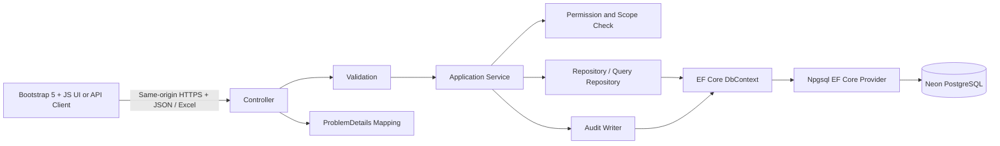
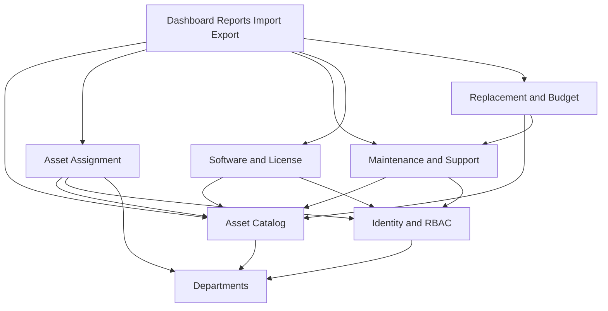
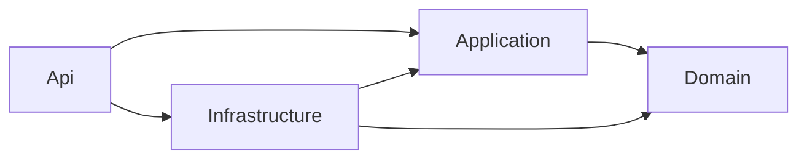
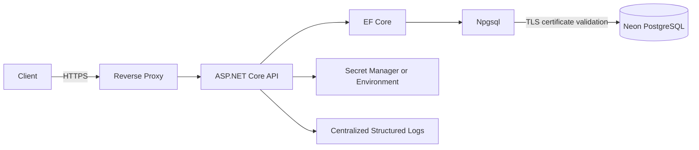

# Kiến trúc hệ thống

> Trạng thái: **PLANNED — Week 2.** Chưa tạo solution, project skeleton hoặc code nghiệp vụ.

## 1. Lựa chọn kiến trúc

Hệ thống dự kiến là **layered modular monolith** trên **.NET 10 / ASP.NET Core Web API**, Entity Framework Core, `Npgsql.EntityFrameworkCore.PostgreSQL` và PostgreSQL hosted on Neon (ADR-018). Controller–Service–Repository và ranh giới module/layer không thay đổi. Một database development Neon được Thủy và Thiện dùng chung từ hai backend local; không dùng local database làm development chính.

Không đưa microservices, CQRS, message broker, Redis, Elasticsearch, event bus, Kubernetes hoặc GraphQL vào giai đoạn hiện tại. Chỉ bổ sung hạ tầng mới khi có yêu cầu/đo lường thực tế và ADR được phê duyệt.

## 2. Luồng xử lý chuẩn



Luồng bắt buộc được giữ nhất quán:

```text
Request
→ Controller
→ Validation
→ Service
→ Repository
→ DbContext / EF Core
→ Npgsql.EntityFrameworkCore.PostgreSQL
→ PostgreSQL hosted on Neon
```

Authorization có hai lớp: policy tại endpoint chặn quyền chức năng; service/repository tiếp tục kiểm tra scope đối tượng để ngăn BOLA. Audit của thay đổi nghiệp vụ được ghi trong cùng transaction khi cần tính atomic.

## 3. Trách nhiệm từng layer

### 3.1 Controllers / API layer

- Định nghĩa REST endpoint `/api/v1`, status code, content type và OpenAPI metadata.
- Bind request DTO, gọi validator và application service.
- Lấy identity/correlation context đã được middleware xác thực.
- Trả response DTO hoặc `ProblemDetails`; không trả entity EF trực tiếp.
- Không chứa business rule lớn, không truy cập `DbContext` và không tự mở transaction nghiệp vụ.

### 3.2 Validation

- Kiểm tra cấu trúc đầu vào: required, length, range, enum, định dạng email/date, page/pageSize/sort allow-list.
- Kiểm tra an toàn file import: extension, MIME/signature, kích thước, header và giới hạn dòng.
- Trả lỗi 400 có field-level details nhất quán.
- Không thay thế business validation cần đọc database; các rule như asset đang được assign hoặc capacity license thuộc service.
- Thư viện validation cụ thể sẽ được chốt khi tạo skeleton; không thêm dependency chỉ để phục vụ tài liệu.

### 3.3 Application Services

- Điều phối use case và là ranh giới transaction chính.
- Thực thi business rules, state transition, permission scope và concurrency.
- Gọi một hoặc nhiều repository, thêm history và audit trong đúng transaction.
- Chuyển entity sang DTO; không trả secrets hoặc license key đầy đủ theo mặc định.
- Không phụ thuộc HTTP-specific type trừ abstraction nhỏ cho current user/correlation context.

Ví dụ `TransferAsset` phải đóng assignment cũ, mở assignment mới, cập nhật trạng thái/history và ghi audit trong một transaction atomic.

### 3.4 Repositories

- Bao gói truy vấn và persistence cho aggregate; dùng EF Core async APIs.
- Áp dụng filter, sort allow-list, projection và pagination ở database.
- Cung cấp truy vấn có tracking/lock phù hợp cho lệnh cần transaction.
- Không chứa business logic, authorization policy hoặc tạo HTTP response.
- Không tạo generic repository quá trừu tượng chỉ để bọc lại toàn bộ `DbSet`; repository/query service phải thể hiện ý định nghiệp vụ.

### 3.5 DbContext / EF Core / Data

- Khai báo mapping tường minh snake_case, PK/FK, CHECK/partial unique indexes, global conventions và optimistic concurrency `row_version bytea` app-managed theo ADR-019. Không thêm native PostgreSQL enum, extension hoặc entity.
- Quản lý transaction do service yêu cầu; cấu hình retry chỉ với chiến lược an toàn/idempotent.
- Tạo migration có review trong Week 3+ sau khi kế hoạch được phê duyệt.
- Không lazy-load; query đọc ưu tiên `AsNoTracking()` và projection.
- `SaveChanges` interceptor có thể bổ sung timestamp/audit metadata, nhưng không được che giấu business history quan trọng.

#### Provider và DbContext registration — PLANNED ONLY

Package provider là `Npgsql.EntityFrameworkCore.PostgreSQL`; không còn planned `UseSqlServer`. Exact version chưa chọn: đối chiếu SDK 10.0.400 / `dotnet --list-sdks`, EF Core major, target framework và official provider dependencies trong Week 3 trước pin/restore/build. Pattern sau chỉ là tài liệu, chưa tạo Program.cs hoặc AppDbContext:

```csharp
builder.Services.AddDbContext<AppDbContext>(options =>
    options.UseNpgsql(
        builder.Configuration.GetConnectionString("DefaultConnection")));
```

`ConnectionStrings:DefaultConnection` nhận secret từ user-secrets hoặc `ConnectionStrings__DefaultConnection`; không hard-code. Neon setup **PLANNED**, connection **NOT CONFIGURED / NOT VERIFIED**. Runtime pooled endpoint; migration direct endpoint/credential riêng, Thủy điều phối theo [database change lock](git-collaboration.md#database-change-lock--neon-shared-development-planned). [Npgsql official configuration](https://www.npgsql.org/efcore/).

### 3.6 Domain models / Entities

- Biểu diễn trạng thái và invariant của aggregate ở mức hợp lý.
- Không mang dependency tới Controller/HTTP/serialization.
- Enum/value constraints phải khớp database và API contract.
- Entity không được expose trực tiếp; DTO kiểm soát property-level authorization và chống mass assignment.

### 3.7 DTOs

- Tách request DTO theo use case (`Create`, `Update`, `Assign`, `Return`) thay vì một DTO khổng lồ.
- Response DTO chỉ chứa trường caller được phép xem; full license key không thuộc response thông thường.
- `row_version` được mã hóa Base64/ETag để hỗ trợ concurrency.
- Danh sách sử dụng response pagination chuẩn từ API spec.

### 3.8 Middleware

- Correlation ID, centralized exception handling, ProblemDetails, request logging đã redact, authentication và security headers.
- Thứ tự pipeline dự kiến: forwarded headers từ proxy tin cậy → correlation → exception handler → HTTPS/HSTS → CORS → authentication → authorization → rate limiting → endpoint.
- Không log request/response body mặc định; tuyệt đối không log password, token hoặc full license key.

### 3.9 Authorization

- JWT authentication và permission-based policies ánh xạ từ role/permission.
- Endpoint policy kiểm tra quyền chức năng; service kiểm tra data scope/ownership/department để ngăn IDOR/BOLA.
- Default deny; không suy quyền chỉ từ việc biết ID hoặc gọi được endpoint.
- Thay đổi role/permission phải audit và làm hết hiệu lực cache quyền nếu có.

### 3.10 Common / Cross-cutting

- Abstraction cho clock UTC, current user, correlation ID, pagination, error code và encryption service.
- Không biến `Common` thành nơi chứa business logic hỗn tạp.
- Logging có cấu trúc và metrics tối thiểu, không chứa dữ liệu nhạy cảm.

## 4. Phân ranh module



Mũi tên `A --> B` nghĩa là module A cần capability của module B, không biểu diễn FK hoặc thứ tự request. Audit là cross-cutting service được các module gọi qua interface và chỉ nhận scalar actor/entity IDs; không tạo chiều phụ thuộc ngược. FK `created_by_user_id` trong Departments là metadata database, không có nghĩa Departments gọi Identity module.

| Module | Trách nhiệm | Phụ thuộc chính |
|---|---|---|
| Identity & RBAC | Login, user, role, permission, policy | Departments (user department) |
| Departments | Cây đơn vị, scope dữ liệu | Không phụ thuộc module nghiệp vụ; actor ID là metadata |
| Assets | Loại, tài sản, trạng thái/vòng đời | Departments |
| Assignments | Giao, thu hồi, chuyển, lịch sử | Assets, Departments, Identity |
| Maintenance | Ticket, state machine, lịch sử/chi phí | Assets, Identity |
| Software & License | Software, license, capacity, cấp/thu hồi | Assets, Identity |
| Replacement | Rule, đánh giá, recommendation/budget input | Assets, Maintenance |
| Reporting / Import / Export | Query tổng hợp và batch I/O | Các module đọc; command qua service sở hữu aggregate |
| Audit | Nhật ký append-only, truy vấn có quyền | Cross-cutting interface, nhận scalar actor ID; không gọi ngược module nghiệp vụ |

Ranh giới module là logic trong một solution/database, không phải network boundary. Module không được sửa trực tiếp bảng do module khác sở hữu; phối hợp qua service/repository contract nội bộ.

## 5. Cấu trúc solution dự kiến

```text
src/
├── ItAssetManagement.Api/
│   ├── Controllers/
│   ├── Middleware/
│   ├── Authorization/
│   ├── wwwroot/ (Bootstrap 5 local, HTML/CSS/JS modules)
│   └── Program.cs
├── ItAssetManagement.Application/
│   ├── DTOs/
│   ├── Validation/
│   ├── Services/
│   └── Contracts/
├── ItAssetManagement.Domain/
│   ├── Entities/
│   ├── Enums/
│   └── Rules/
└── ItAssetManagement.Infrastructure/
    ├── Data/
    ├── Repositories/
    ├── Security/
    └── Logging/
tests/
├── ItAssetManagement.UnitTests/
└── ItAssetManagement.IntegrationTests/
docs/
```

Đây là cấu trúc **PLANNED**. Có thể gộp `Domain`/`Application` nếu implementation cho thấy chi phí ceremony lớn hơn lợi ích, nhưng thay đổi phải cập nhật ADR. Không tạo cấu trúc này trong Week 2.

### Frontend M1 và API integration — PLANNED

Web UI ở `Api/wwwroot` được ASP.NET Core phục vụ cùng origin với `/api/v1`; không mở project framework, dev server hoặc CORS riêng. Bootstrap 5 pin phiên bản và giữ local để demo offline. Một `index.html` chứa Login và admin shell, cùng `js/api-client.js`, `js/auth.js`, `js/assets.js`, `js/masters.js`, `css/app.css` là cấu trúc dự kiến. Login thành công đổi view trong cùng document; Dashboard/List/Create/Detail/Edit dùng hash navigation như `#/assets/12/edit`, không tải trang HTML khác. Cách này giữ token in-memory trong suốt demo flow mà không thêm framework. Nếu cần alias `login.html`, alias chỉ redirect về shell trước khi đăng nhập và không nhận/chuyển token. `api-client.js` xử lý Bearer, JSON, ProblemDetails và 401/403/409; page modules không tự ghép endpoint tùy ý. Reload hoặc mở tab mới phải login lại; logout xóa token/state và đổi về Login trong shell. Không có server cookie auth nên không có CSRF cookie flow cho M1; XSS protection, CSP và safe DOM rendering vẫn bắt buộc. Chi tiết màn hình/field/API tại [UI/UX spec](ui-ux-spec.md).

Week 3 Dashboard cơ bản dùng EP-023 để hiển thị tổng/asset gần nhất. EP-072–075 dashboard aggregates đầy đủ được triển khai Week 6; UI không hiển thị số giả hay mặc định zero cho metric chưa tồn tại. Shared frontend layout/API client do Thủy sở hữu; Thiện thêm page module của mình trong file riêng theo [team responsibilities](team-responsibilities.md).

## 6. Dependency rule



- `Domain` không phụ thuộc project khác.
- `Application` phụ thuộc Domain và chỉ biết interface hạ tầng.
- `Infrastructure` triển khai persistence, encryption, audit và external concerns.
- `Api` là composition root, đăng ký dependency injection và HTTP pipeline.
- Không vòng phụ thuộc; interface đặt ở layer tiêu thụ để dependency hướng vào trong.

## 7. Read/write và hiệu năng

- Command tải aggregate cần thiết, kiểm tra `rowVersion` opaque/app-managed `row_version`, thực thi transaction và ghi history/audit.
- Query danh sách dùng projection thẳng DTO, filter/sort/pagination tại SQL; không load toàn bảng rồi xử lý memory.
- Dashboard/report dùng aggregate SQL (`COUNT`, `SUM`, `GROUP BY`) và index đã thiết kế; chỉ cache khi đo được nhu cầu.
- Mặc định `pageSize=20`, tối đa theo API spec; sort field phải allow-list.
- Tránh N+1; chỉ `Include` khi thật cần, ưu tiên projection.
- Query chậm được quan sát/đo trước khi thêm index hoặc cache.

## 8. Transaction, concurrency và consistency

- Service sở hữu transaction cho use case nhiều bước: transfer asset, thay đổi status + history, resolve maintenance, cấp license, import all-or-nothing.
- `row_version bytea` với EF `IsConcurrencyToken()` bảo vệ lost update; central SaveChanges tạo 16 random bytes mới cho mọi insert/update mutable row theo ADR-019. Stale write trả `409`; archive thiếu `If-Match` trả `428`, token sai định dạng trả `400`. Không dùng SQL Server `IsRowVersion()` hoặc xmin thay column baseline.
- Partial unique index là lớp bảo vệ cuối cho một active assignment; giữ business invariants và 18 tables / 41 relationships.
- Capacity license khóa parent license bằng `SELECT ... FOR UPDATE` trong transaction trước count/write; mọi allocation/revoke/transfer/quantity change theo cùng lock. SERIALIZABLE là alternative có xử lý serialization failure; không dùng SQL Server locking hints.
- Audit/history cùng transaction với thay đổi nghiệp vụ khi yêu cầu bằng chứng atomic; login failure có transaction audit riêng.
- Không dùng distributed transaction vì kiến trúc một database.

## 9. Xử lý lỗi

- Middleware ánh xạ lỗi validation 400, authentication 401, authorization 403, not found 404, concurrency/business conflict 409, thiếu precondition archive 428, unsupported media 415, payload too large 413, rate limit 429 và unexpected 500.
- Response dùng RFC ProblemDetails với stable error code/correlation ID; không lộ stack trace, SQL hoặc secret.
- Service trả typed result/exception có chủ đích; không bắt `Exception` rồi bỏ qua.
- Database transient retry phải tránh lặp side effect/audit; command idempotency được xem xét cho import và request retry.

## 10. Security by architecture

- TLS bắt buộc; CORS allow-list; secret từ environment/user-secrets/dev vault hoặc secret manager production.
- Password chỉ hash bằng ASP.NET PasswordHasher; JWT access ngắn hạn, không refresh token ở phiên bản đầu.
- License key được mã hóa qua `ILicenseKeyProtector`, key nằm ngoài database/source; response mặc định chỉ masked last four.
- DTO và projection chống overposting/property exposure; policy + object scope ngăn BFLA/BOLA.
- Audit/logging redaction tập trung; database account least privilege.
- Import Excel đi qua vùng tạm ngoài web root, giới hạn tài nguyên và parser an toàn.

Chi tiết tại `security.md` và `audit-log.md`.

## 11. Deployment topology dự kiến



- Một API instance là đủ cho demo; thiết kế stateless cho phép scale-out sau này.
- Migration chạy bằng deployment identity riêng trước rollout, không tự chạy với quyền cao mỗi lần API khởi động ở production.
- Health checks tách liveness/readiness; không trả secret hoặc chi tiết hạ tầng.
- Hạ tầng triển khai cụ thể còn **PLANNED** trong `deployment.md`.

Shared development topology **PLANNED**:

```text
Thủy: ASP.NET Core backend -> EF Core/Npgsql --TLS--+
                                                  +-> Neon PostgreSQL shared development
Thiện: ASP.NET Core backend -> EF Core/Npgsql --TLS-+
```

`it_asset_management_dev` chỉ là logical-name proposal, không phải tên Neon đã xác minh. Automated tests dùng isolated PostgreSQL target riêng, không drop/schema/truncate shared development/demo database.

## 12. Observability

- Correlation ID xuyên request, business history và audit.
- Structured logs cho request metadata, latency, status, error code; redaction bắt buộc.
- Metrics dự kiến: latency/error/rate, connection pool, query chậm, login failure, denied authorization, import outcome.
- Audit log không thay thế operational log; operational log không thay thế audit log.
- Không tuyên bố monitoring/alert đã chạy khi chưa triển khai và kiểm chứng.

## 13. Kiểm thử theo layer

- Unit: validator, state transition, service business rule, replacement calculation.
- Integration: repository/constraint với PostgreSQL test target cô lập khỏi shared Neon development/demo, transaction, concurrency, auth policy và API ProblemDetails. Chưa có test harness; phải fail closed nếu chưa cấu hình isolation.
- Không mock EF Core để khẳng định constraint/index hoạt động; dùng database engine thật cho integration test quan trọng.
- xUnit là framework chuẩn dự kiến; chưa có test project trong Week 2.

## 14. Guardrails review

- Controller không chứa business logic lớn hoặc query `DbContext`.
- Repository không ra quyết định nghiệp vụ/authorization.
- Entity không xuất thẳng qua HTTP.
- Validation input không thay thế kiểm tra business trong transaction.
- Không thêm framework/hạ tầng vượt nhu cầu.
- Tên entity/quan hệ phải khớp `database-design.md`, `erd.md` và `api-spec.md`.
- Kiến trúc và toàn bộ module hiện đều **PLANNED**; chỉ tài liệu Week 2 đã được tạo.
