# ERD — Enterprise IT Asset & Infrastructure Management System

> Trạng thái: **FULL LOGICAL DESIGN DOCUMENTED / UNDER REVIEW**; M1 physical subset 10 tables/19 FKs CREATED / VERIFIED 02/10/2026. Các bảng/quan hệ ngoài M1 vẫn PLANNED. [Implementation evidence](neon-database-setup.md).

> Database Engine: **PostgreSQL**, hosting **Neon** — M1 setup CONNECTED / VERIFIED (ADR-022). Schema Baseline V1 vẫn **18 tables / 41 relationships**; Mermaid block giữ nguyên. `binary row_version` map app-managed bytea, `json` map jsonb, `datetime` map timestamptz UTC. Không thêm EF migration metadata vào logical diagram.

## 1. Sơ đồ quan hệ

```mermaid
erDiagram
    departments {
        bigint id PK
        string code UK
        string name
        bigint parent_department_id FK
        bigint created_by_user_id FK
        bigint updated_by_user_id FK
        boolean is_active
        binary row_version
    }

    users {
        bigint id PK
        bigint department_id FK
        bigint created_by_user_id FK
        bigint updated_by_user_id FK
        string username
        string normalized_username UK
        string email
        string normalized_email UK
        string password_hash
        string employee_code UK
        boolean is_active
        boolean is_admin_locked
        int token_version
        binary row_version
    }

    roles {
        bigint id PK
        string code UK
        string name
        boolean is_active
        binary row_version
    }

    user_roles {
        bigint id PK
        bigint user_id FK
        bigint role_id FK
        bigint assigned_by_user_id FK
        datetime assigned_at_utc
    }

    permissions {
        bigint id PK
        string code UK
        string module
        boolean is_active
        binary row_version
    }

    role_permissions {
        bigint id PK
        bigint role_id FK
        bigint permission_id FK
        bigint granted_by_user_id FK
        datetime granted_at_utc
    }

    asset_types {
        bigint id PK
        string code UK
        string name
        int default_useful_life_months
        boolean is_active
        binary row_version
    }

    assets {
        bigint id PK
        string asset_code UK
        bigint asset_type_id FK
        bigint owning_department_id FK
        bigint created_by_user_id FK
        bigint updated_by_user_id FK
        string serial_number UK
        string current_status
        decimal purchase_cost
        boolean is_archived
        binary row_version
    }

    asset_status_histories {
        bigint id PK
        bigint asset_id FK
        bigint changed_by_user_id FK
        string from_status
        string to_status
        string source
        datetime changed_at_utc
        uuid correlation_id
    }

    asset_assignments {
        bigint id PK
        bigint asset_id FK
        bigint assigned_user_id FK
        bigint assigned_department_id FK
        bigint assigned_by_user_id FK
        bigint returned_by_user_id FK
        datetime assigned_at_utc
        datetime returned_at_utc
        boolean is_archived
        binary row_version
    }

    maintenance_tickets {
        bigint id PK
        string ticket_code UK
        bigint asset_id FK
        bigint requested_by_user_id FK
        bigint assigned_to_user_id FK
        string priority
        string status
        decimal actual_cost
        boolean is_archived
        binary row_version
    }

    maintenance_histories {
        bigint id PK
        bigint maintenance_ticket_id FK
        bigint performed_by_user_id FK
        string event_type
        string from_status
        string to_status
        bigint from_assigned_to_user_id FK
        bigint to_assigned_to_user_id FK
        datetime performed_at_utc
        uuid correlation_id
    }

    softwares {
        bigint id PK
        string code UK
        string name
        string publisher
        boolean is_active
        binary row_version
    }

    software_licenses {
        bigint id PK
        bigint software_id FK
        string license_code UK
        string license_type
        int total_quantity
        binary license_key_ciphertext
        string license_key_last4
        datetime expires_at_utc
        boolean is_active
        binary row_version
    }

    license_assignments {
        bigint id PK
        bigint software_license_id FK
        bigint assigned_user_id FK
        bigint assigned_asset_id FK
        bigint assigned_by_user_id FK
        bigint revoked_by_user_id FK
        datetime assigned_at_utc
        datetime revoked_at_utc
        boolean is_archived
        binary row_version
    }

    replacement_rules {
        bigint id PK
        string code
        int version
        bigint asset_type_id FK
        int minimum_age_months
        decimal maximum_maintenance_cost_ratio
        int minimum_maintenance_count
        decimal estimated_unit_cost
        boolean is_active
        binary row_version
    }

    replacement_recommendations {
        bigint id PK
        bigint asset_id FK
        bigint replacement_rule_id FK
        bigint disposition_by_user_id FK
        string disposition
        boolean is_current
        string priority
        decimal estimated_replacement_cost
        int planned_replacement_year
        json evaluation_snapshot_json
        datetime recommended_at_utc
        binary row_version
    }

    audit_logs {
        bigint id PK
        bigint actor_user_id FK
        string action
        string entity_type
        string entity_id
        string outcome
        uuid correlation_id
        json old_values_json
        json new_values_json
        datetime occurred_at_utc
    }

    departments o|--o{ departments : "parent_of"
    departments o|--o{ users : "contains"
    users o|--o{ departments : "creates_department"
    users o|--o{ departments : "updates_department"
    users o|--o{ users : "creates_user"
    users o|--o{ users : "updates_user"
    users ||--o{ user_roles : "has"
    roles ||--o{ user_roles : "is_assigned"
    users o|--o{ user_roles : "assigns_role"
    roles ||--o{ role_permissions : "grants"
    permissions ||--o{ role_permissions : "is_granted"
    users o|--o{ role_permissions : "grants_permission"

    asset_types ||--o{ assets : "classifies"
    departments ||--o{ assets : "owns"
    users o|--o{ assets : "creates_asset"
    users o|--o{ assets : "updates_asset"
    assets ||--o{ asset_status_histories : "has_status_history"
    users o|--o{ asset_status_histories : "changes_status"
    assets ||--o{ asset_assignments : "has_assignment_history"
    users o|--o{ asset_assignments : "receives_asset"
    departments o|--o{ asset_assignments : "receives_asset"
    users ||--o{ asset_assignments : "assigns_asset"
    users o|--o{ asset_assignments : "returns_asset"

    assets ||--o{ maintenance_tickets : "has_ticket"
    users ||--o{ maintenance_tickets : "requests"
    users o|--o{ maintenance_tickets : "handles"
    maintenance_tickets ||--o{ maintenance_histories : "has_history"
    users o|--o{ maintenance_histories : "performs"
    users o|--o{ maintenance_histories : "was_assigned"
    users o|--o{ maintenance_histories : "became_assigned"

    softwares ||--o{ software_licenses : "has_license"
    software_licenses ||--o{ license_assignments : "allocates"
    users o|--o{ license_assignments : "receives_license"
    assets o|--o{ license_assignments : "receives_license"
    users ||--o{ license_assignments : "assigns_license"
    users o|--o{ license_assignments : "revokes_license"

    asset_types o|--o{ replacement_rules : "scopes_rule"
    replacement_rules ||--o{ replacement_recommendations : "produces"
    assets ||--o{ replacement_recommendations : "is_evaluated"
    users o|--o{ replacement_recommendations : "sets_disposition"
    users o|--o{ audit_logs : "acts_in"
```

## 2. Giải thích cardinality

Ký hiệu Mermaid được hiểu như sau: `||` là đúng một, `o|` là không hoặc một, `o{` là không hoặc nhiều. Các quan hệ chính:

- Một `department` có thể không có hoặc có nhiều phòng ban con; mỗi phòng ban con có tối đa một cha. Chu trình cây được service chặn trong transaction.
- Một user thuộc tối đa một department; một department có nhiều user. Đây là assumption Week 2 và cần Mentor xác nhận nếu nhân sự có thể thuộc nhiều đơn vị.
- `users` và `roles` là nhiều-nhiều qua `user_roles`; `roles` và `permissions` là nhiều-nhiều qua `role_permissions`.
- Một `asset_type` phân loại nhiều asset; mỗi asset thuộc đúng một loại.
- Một department sở hữu nhiều asset; mỗi asset có đúng một department sở hữu tại một thời điểm.
- Một asset có nhiều dòng trạng thái, assignment, maintenance ticket, license assignment và replacement recommendation trong lịch sử.
- Mỗi `asset_assignment` nhắm **đúng một** user hoặc department. Hai FK đều optional trên ERD để biểu diễn XOR; `CHECK` ở database bắt buộc đúng một FK có giá trị.
- Mỗi asset có tối đa một assignment đang hiệu lực; PostgreSQL partial unique index trên `asset_id` bảo đảm bất biến này.
- Một maintenance ticket có nhiều history; mỗi history thuộc đúng một ticket. Ticket và history không bị cascade-delete.
- Một software có nhiều software license; mỗi license có nhiều lượt phân bổ.
- Mỗi `license_assignment` nhắm **đúng một** user hoặc asset, đại diện một seat. `CHECK` bảo đảm XOR; `COUNT(*)` active allocation không vượt `software_licenses.total_quantity`, được service bảo đảm bằng transaction có khóa hàng license.
- Một replacement rule có thể áp dụng cho một asset type hoặc cho tất cả loại khi `asset_type_id` null; rule tạo nhiều recommendation. `(code, version)` là unique ghép; chỉ một phiên bản hiện hành cho mỗi `code` theo PostgreSQL partial unique index. ERD không gắn `UK` riêng lẻ cho hai cột này.
- User có unique index trên `normalized_username` và `normalized_email`; `username`/`email` là giá trị hiển thị. Mỗi Asset có tối đa một recommendation hiện hành (`ACTIVE` hoặc `PLANNED`); chỉ một estimate/năm/Asset đi vào annual budget.
- User là actor tùy chọn của history/audit để cho phép system job và anonymous login failure. Dữ liệu lịch sử vẫn được giữ khi user bị deactivate.

## 3. Quan hệ audit metadata

Các FK người tạo/người sửa tùy chọn trong `departments`, `users` và `assets` được vẽ để ERD bao phủ toàn bộ FK. Chúng không làm user sở hữu aggregate; chỉ là metadata. Mọi FK đều dùng `ON DELETE NO ACTION`, không cascade dữ liệu lịch sử.

## 4. Kiểm tra nhất quán

- Sơ đồ chứa đúng 18 entity theo danh sách khóa của Week 2.
- Mỗi bảng có PK; mọi FK nghiệp vụ cốt lõi và cardinality đều được thể hiện.
- Hai quan hệ target đa hình dùng hai FK nullable kèm XOR constraint, không dùng chuỗi `target_type/target_id` thiếu toàn vẹn tham chiếu.
- ERD khớp tên bảng/cột chính trong `database-design.md`.
- Block ERD được Mermaid parser 11.17.2 kiểm tra cú pháp thành công ngày 29/09 và kiểm lại ngày 01/10/2026; 18 entity/41 FK columns/41 relationships được đối chiếu database design. Chưa xuất/rà hình render PNG/SVG.
- Toàn bộ ERD là **PLANNED**; chưa xác nhận bằng migration hoặc database thực tế.
