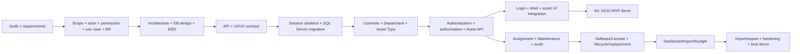

# Task Dependencies & Critical Path — PLANNED

> Đây là dependency triển khai, không chứng minh task đã hoàn tất. M1 phải demo **10/10/2026**. Các công việc Week 3 chỉ bắt đầu sau review/approval của kế hoạch; nếu gate đến muộn, M1 có rủi ro và phải báo thật, không giả lập màn hình/API.

## Critical path M1

| Gate | Owner | Deadline target | Bàn giao tối thiểu | Fallback nếu trễ |
|---|---|---|---|---|
| API/schema/UI contract freeze | Thủy; Thiện review | 03/10 | DTO/route/permission, entity/index và 7 M1 screens rõ | Chỉ chốt M1 subset; phần nâng cao sang Week 4+ bằng decision log |
| Skeleton + database connection + initial migration | Thủy | 06/10 | App start, health/Swagger, test DB sạch | Thiện tiếp tục isolated master-data service/test; Thủy giữ critical integration |
| Department/Asset Type lookup | Thiện | 07/10 | EP-013/018 hoạt động, seed/test data | Thủy dùng fixture/master records đã tạo sau migration để code Asset; UI dropdown không giả data |
| Auth/JWT/role policy | Thủy | 07/10 | EP-001/002 + 401/403 | UI shell có thể làm tĩnh, nhưng không tuyên bố login demo trước API thật |
| Asset create/detail/update/archive/list/filter | Thủy (Thiện viết EP-028, Thủy review) | 09/10 sáng | EP-023–026/028, DB persistence, tests | Cắt status admin/UI archive nâng cao; không cắt backend CRUD/create/edit/filter |
| UI integration + smoke/rehearsal | Thủy; Thiện reviewer | 09/10 chiều | Login→Dashboard→List→Create→Detail/Edit→Search | Thiện test master/UI mobile, Thủy xử lý API/UI mismatch; không thêm module mới |
| M1 demo | Thủy chủ trì; Thiện hỗ trợ | 10/10 | Acceptance trong roadmap, evidence thật | Nếu gate fail, báo missing criteria/issue; không dùng dữ liệu giả thay API/DB |

## Dependency và handoff sau M1

| Producer → Consumer | Contract bắt buộc | Buffer/fallback |
|---|---|---|
| Thủy Asset/User/Department → Thiện Assignment | Asset status transition, active user/department, rowversion, EP-030–035 | Thiện viết DTO/rule/unit test trước; schema/migration chỉ sau freeze |
| Thủy Asset status/Audit → Thiện Maintenance | Ticket transition và history/actor/correlation | Thiện làm ticket service/test không chạm shared middleware |
| Thiện Maintenance cost/history → Thiện Replacement + Thủy Reports | Actual cost source of truth, failure count, year/currency | Thủy dùng fixed fixture query contract; không tính budget từ event snapshots |
| Thiện License/Recommendation → Thủy Dashboard/Report | Masked key, current recommendation, active seat counts | Thủy làm asset-only aggregates trước; widget thiếu data hiện unavailable, không số giả |
| Thủy Report query → Thiện Export | Filter, scope, projection và cap | Thiện viết workbook mapping/test với fixture, chưa nối endpoint khi query chưa freeze |
| Thủy API client/layout → Thiện module UI | Error/401/403/409 helper, navigation, permission flags | Thiện làm HTML module riêng với test fixture; không sửa layout/client song song |

## Rủi ro lịch và sequencing

- Week 3 có sáu ngày từ skeleton đến UI demo. Không kéo user-admin đầy đủ, asset archive hay report nâng cao vào critical path nếu làm trễ M1. Các endpoint non-M1 vẫn **PLANNED** theo roadmap và sẽ được triển khai sau khi M1 gate ổn định.
- Database migration là serialized shared task của Thủy; Thiện cung cấp config/constraint proposal, tránh merge conflict. Mọi schema change có DB design/ERD/API/test cập nhật cùng PR.
- Từ Week 4 trở đi, module owner kiểm thử cùng ngày/lát cắt; Thứ 7 dành cho integration và sửa lỗi, không bắt đầu module lớn.
